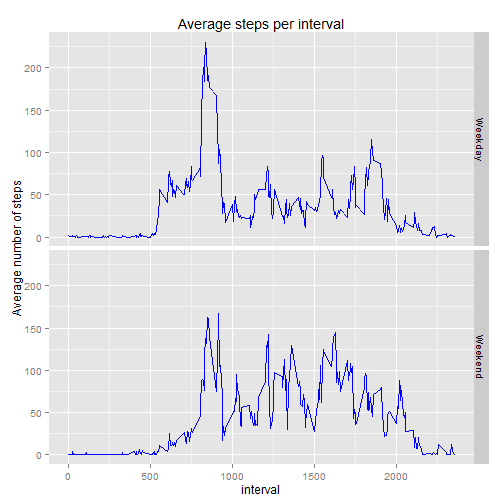

##Part 1 - Loading and preprocessing the data


ggplot2, plyr and dplyr packages loaded - to be used later

```r
library(ggplot2)
library(plyr)
library(dplyr)
```

The data was read into R using the read.csv function.  The date column was then converted to the date format.  Note:  the csv file needs to be in the working directory.

```r
#read the data
step_data<-read.csv("activity.csv",header=TRUE,na.strings="NA")
```

```
## Warning in file(file, "rt"): cannot open file 'activity.csv': No such file
## or directory
```

```
## Error in file(file, "rt"): cannot open the connection
```

```r
#Format the dates
step_data$date<-as.Date(step_data$date)
str(step_data)
```

```
## 'data.frame':	17568 obs. of  3 variables:
##  $ steps   : int  NA NA NA NA NA NA NA NA NA NA ...
##  $ date    : Date, format: "2012-10-01" "2012-10-01" ...
##  $ interval: int  0 5 10 15 20 25 30 35 40 45 ...
```


##Part 2 - What is mean total number of steps taken per day?

Calculate the total steps each day using functions from the dplyr package

```r
#Calculate the steps per day
steps_per_day<-step_data %>%
        na.omit() %>%
        group_by(date) %>%
        summarize(total_steps=sum(steps))
steps_per_day
```

```
## Source: local data frame [53 x 2]
## 
##          date total_steps
## 1  2012-10-02         126
## 2  2012-10-03       11352
## 3  2012-10-04       12116
## 4  2012-10-05       13294
## 5  2012-10-06       15420
## 6  2012-10-07       11015
## 7  2012-10-09       12811
## 8  2012-10-10        9900
## 9  2012-10-11       10304
## 10 2012-10-12       17382
## ..        ...         ...
```

Create a histogram using the base plotting system

```r
hist(steps_per_day$total_steps,breaks=20,xlab="Total Steps per Day",
     main="Histogram of Total Steps per Day")
```

 

Calculate the Mean and Median steps per day

```r
mean_steps<-format(mean(steps_per_day$total_steps),big.mark=",",scientific=FALSE)

median_steps<-format(median(steps_per_day$total_steps),big.mark=",",scientific=FALSE)
```

The Mean number of steps per day is 10,766.19 and the Median is 10,765.


##Part 3 - What is the average daily activity pattern?


Calculate the average number of steps taken per time period - averaged across all days

```r
step_intervals<-step_data %>%
        na.omit() %>%
        group_by(interval) %>%
        summarize(average_steps=mean(steps))
```

Plot the results

```r
plot(step_intervals,type="l",xlab="5-Minute Interval",
     ylab="Average Number of Steps Taken",
     main="Average Number of Steps Taken per 5-Minute Interval:  
     Averaged Accross All Days")
```

 

Calculate the 5-Minute Interval with the maximum average number of steps

```r
maximum_steps<-max(step_intervals$average_steps)
maximum_interval<-step_intervals$interval[step_intervals$average_steps==maximum_steps]
```
The interval with the highest number of steps is interval #835 with an average of 206.17 steps.


##Part 4 - Imputing missing values

Calculate the number of missing values in each column

```r
apply(is.na(step_data),2,sum)
```

```
##    steps     date interval 
##     2304        0        0
```

Calculte the number of missing values and the proportion of missing values for the "steps" column.

```r
missing_value_count<-sum(is.na(step_data$steps))
missing_value_prop<-mean(is.na(step_data$steps))
```
There are 2304 missing values, which is 13.11% of the total rows.

Fill in missing data with the average of the 5-Minute Interval

```r
imputed_data<-step_data

missing_data_index<-which(is.na(imputed_data$steps))

for (i in missing_data_index) {
        imputed_data$steps[i]<-round(with(step_intervals,average_steps[interval==imputed_data$interval[i]]),0)
}
```

Calculate the total steps each day using functions from the dplyr package

```r
imputed_steps_per_day<-imputed_data %>%
        group_by(date) %>%
        summarize(total_steps=sum(steps))
```

Create a histogram using the base plotting system

```r
par(mfrow=c(1,2))
hist(steps_per_day$total_steps,breaks=20,ylim=c(0,18),xlab="Total Steps per Day",
     main="Histogram of Total Steps per Day
     Raw")
hist(imputed_steps_per_day$total_steps,breaks=20,ylim=c(0,18),xlab="Total Steps per Day",
     main="Histogram of Total Steps per Day
     Imputed")
```

 

Calculate the Mean and Median steps per day

```r
imputed_mean_steps<-format(mean(imputed_steps_per_day$total_steps),big.mark=",",scientific=FALSE)

imputed_median_steps<-format(median(imputed_steps_per_day$total_steps),big.mark=",",scientific=FALSE)
```

With the imputed values the Mean number of steps per day is 10,765.64 and the Median is 10,762.  The mean is 0.55 steps per day lower than with the raw data, and the median went down 3 steps per day.


##Part 5 - Are there differences in activity patterns between weekdays and weekends?

Create a factor variable with "Weekday" and "Weekend"

```r
imputed_data2<-imputed_data

imputed_data2[weekdays(imputed_data2$date)%in%c("Saturday","Sunday"),"day_type"]<-"Weekend"
imputed_data2[is.na(imputed_data2$day_type),"day_type"]<-"Weekday"
imputed_data2$day_type<-factor(imputed_data2$day_type)
```

Plot the averge steps per interval - divided into Weekday and Weekend

```r
imputed_step_intervals2<-imputed_data2 %>%
        group_by(interval,day_type) %>%
        summarize(average_steps=mean(steps))

g<-ggplot(imputed_step_intervals2, aes(x = interval, y = average_steps))

g +
        geom_line(col = 'Blue') + 
        ylab('Average number of steps') + 
        xlab('interval') + 
        ggtitle('Average steps per interval') + 
        facet_grid(day_type ~ .)
```

 
